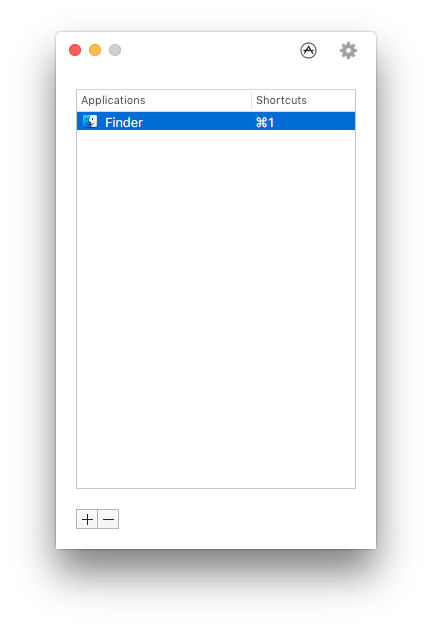
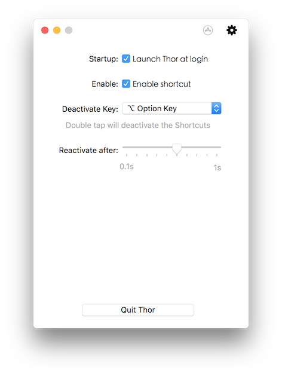

# Thor

Open the right application ASAP.



Thor is an OS X application that allows you to open other application immediately just by a shortcut. And it's avaliable in [Mac App Store](https://itunes.apple.com/app/thor/id1120999687?ls=1&mt=12)! Feel free to enjoy the increased efficiency.



## Build from source

* Xcode 7.3 or later
* [CocoaPods](https://cocoapods.org/)

Thor uses [Cocoapods](https://cocoapods.org/) as dependency manager, follow the instructions below to build all dependencies.

```
git clone https://github.com/gbammc/Thor.git
cd /path/to/Thor
pod install
```

## Download

[Click here to download the latest release.](https://github.com/gbammc/Thor/releases)

## Thanks

The UI idea is from [Pomodoro One](http://rinik.net/pomodoro/) and thanks to the great work of [MASShortcut](https://github.com/shpakovski/MASShortcut) !

## License

#### The MIT License (MIT)


Copyright (c) 2014 – 2016 Alvin Zhu

Permission is hereby granted, free of charge, to any person obtaining a copy
of this software and associated documentation files (the "Software"), to deal
in the Software without restriction, including without limitation the rights
to use, copy, modify, merge, publish, distribute, sublicense, and/or sell
copies of the Software, and to permit persons to whom the Software is
furnished to do so, subject to the following conditions:

The above copyright notice and this permission notice shall be included in all
copies or substantial portions of the Software.

THE SOFTWARE IS PROVIDED "AS IS", WITHOUT WARRANTY OF ANY KIND, EXPRESS OR
IMPLIED, INCLUDING BUT NOT LIMITED TO THE WARRANTIES OF MERCHANTABILITY,
FITNESS FOR A PARTICULAR PURPOSE AND NONINFRINGEMENT. IN NO EVENT SHALL THE
AUTHORS OR COPYRIGHT HOLDERS BE LIABLE FOR ANY CLAIM, DAMAGES OR OTHER
LIABILITY, WHETHER IN AN ACTION OF CONTRACT, TORT OR OTHERWISE, ARISING FROM,
OUT OF OR IN CONNECTION WITH THE SOFTWARE OR THE USE OR OTHER DEALINGS IN THE
SOFTWARE.


